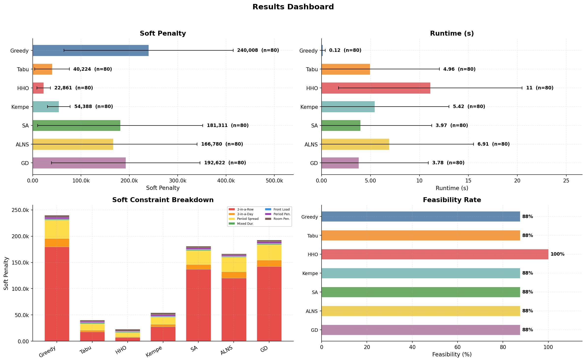
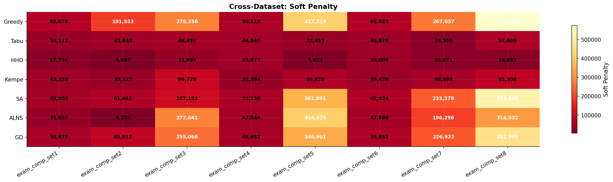
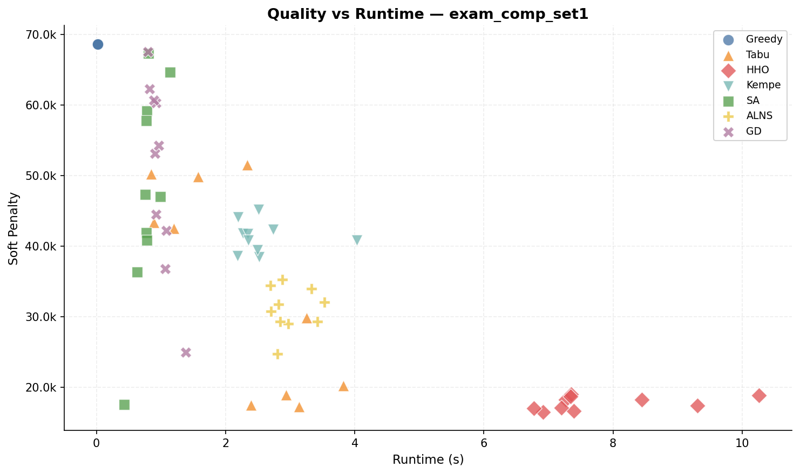

<h1 align="center">Exam Scheduling</h1>

<p align="center">
  <i>Twelve algorithms, one C++ solver, eight ITC 2007 datasets —<br/>
  all fighting over where to put next semester's exams.</i>
</p>

<p align="center">
  <b>Hoang Le</b> &nbsp;·&nbsp; <b>Ian Cronin</b>
</p>

<p align="center">
  
</p>

<p align="center"><sub><i>Baseline run across seven algorithms, aggregated over 8 datasets × 10 seeds (n=80 per bar).</i></sub></p>

---

## What's going on here

Capacitated examination timetabling is an NP-hard cousin of graph coloring. You start with a pile of exams, a bunch of students, a fixed set of periods, and a fixed set of rooms and you have to place every exam somewhere without:

- sending any student to two papers at the same time
- overflowing a room
- (or) cramming a long exam into a short slot

Those are the *hard* constraints. Once you're legal, the real fight begins: *soft* penalties for back-to-back exams, tight spreads, mixed durations in the same room, front-loading, and expensive period/room choices.

One C++ solver hosting eleven algos (excluding a handler algo), a Python bridge that falls back gracefully when the binary isn't built, an auto-tuner that hunts for better defaults across datasets, and a handful of plot types for research-quality figures. Everything runs against the [ITC 2007 Examination Track](https://www.eeecs.qub.ac.uk/itc2007/examtrack/) benchmark and a synthetic generator.

## Quick start

```bash
make                                        # build the C++ solver
pip install -r requirements.txt
python main.py --dataset instances/exam_comp_set4.exam
```

That runs every C++ algorithm on set4 (273 exams — small and fast) and drops the output into a new batch under `results/`. For interactive tinkering, open `exam_scheduling.ipynb`.

## Headline results

Lower is better everywhere. **HHO** wins on quality. **Greedy** wins on speed. **Tabu** is the all-rounder. The tightly-constrained sets (5 and 8) punish anything that can't reason carefully about room capacity.

<p align="center">
  
</p>

<p align="center"><sub><i>Cross-dataset soft penalty. HHO holds up across the board; Greedy, SA, ALNS, and GD collapse on the room-capacity-heavy sets 5 and 8.</i></sub></p>

<p align="center">
  
</p>

<p align="center"><sub><i>Quality–runtime trade-off on set1 (607 exams). HHO dominates the cost axis but pays for it in seconds; ALNS and Tabu sit comfortably on the Pareto frontier.</i></sub></p>

> The figures above show the **seven baseline algorithms**. ABC, GA, LAHC, Natural Selection, and the IP solver were added after the baseline run and are listed in the algorithm table below — their numbers just aren't in these specific plots yet.

## Datasets

| Set | Exams | Notes |
|-----|------:|-------|
| set4 | 273 | Small, fast — good for quick tests and parameter sweeps |
| set6 | 242 | Smallest set, minimal constraints |
| set8 | 598 | Medium, well-constrained |
| set1 | 607 | Medium, classic benchmark |
| set2 | 870 | Large, low constraint density |
| set3 | 934 | Hardest — dense period constraints |
| set5 | 1018 | Large, tight room capacity |
| set7 | 1096 | Largest set |

All sourced from the [ITC 2007 Examination Track](https://www.eeecs.qub.ac.uk/itc2007/examtrack/). The synthetic generator also writes out in ITC 2007 format, so anything that reads a real set reads a fake one too.

## Algorithms

| Algorithm | Type | Description |
|---|---|---|
| **Greedy** | Constructive | DSatur graph-coloring heuristic |
| **Tabu Search** | Local search | Feasibility-first with swap + room-only moves |
| **HHO** | Population | Harris Hawks with Levy flights + smart perturbation |
| **Kempe Chain** | Local search | Conflict-chain period swaps with SA acceptance |
| **Simulated Annealing** | Local search | FastSA pruning, swap moves, room-only moves |
| **ALNS** | Hybrid | Adaptive destroy-and-repair with proximity-aware operators |
| **Great Deluge** | Local search | Linearly decaying acceptance level + swap moves |
| **ABC** | Swarm | Artificial Bee Colony with cost-weighted multi-move bees |
| **Genetic Algorithm** | Evolutionary | Memetic GA: delta-based crossover + local-search mutation |
| **LAHC** | Local search | Late Acceptance Hill Climbing with history list |
| **Natural Selection** | Meta | Trials all algorithms, runs top-N at full budget |
| **IP** | Exact | Constraint programming via OR-Tools CP-SAT (Python) |

All C++ algorithms are called from Python through `cpp_bridge.py`. If the binary isn't compiled, Python fallbacks kick in automatically — you never get stuck waiting on a build.

**Natural Selection** (`--algo ns`) is a meta-algorithm and not part of `--algo all`.

### What makes them fast

A few optimizations matter more than the rest:

- **Delta evaluation** — `move_delta()` is O(k) instead of the O(n²) full eval per move. This is the single biggest speedup and every local-search algorithm leans on it.
- **Swap moves** — SA, LAHC, and GD expand their neighborhood beyond single-exam re-assignment by exchanging the periods of two exams at once.
- **FastSA pruning** — at low temperature, "frozen" exams get skipped. About a 90% skip rate on inactive bins.
- **Room post-processing** — `optimize_rooms()` runs a steepest-descent room reassignment on the final solution. Cheap, always worth it.
- **Warm-start chaining** — `--init-solution` pipes one algorithm's output into the next (e.g. `SA → GD`), so later stages start from a better place.

## Auto-tuner

Automated parameter optimization and algorithm-chain discovery. Supports single-dataset tuning or **global multi-dataset mode** to avoid overfitting.

```bash
# Single dataset
python -m tooling.auto_tuner instances/exam_comp_set4.exam

# Global — all ITC 2007 sets (recommended; prevents overfitting)
python -m tooling.auto_tuner --all-sets
python -m tooling.auto_tuner --all-sets --synthetic          # include generated data
python -m tooling.auto_tuner --all-sets --max-time 20        # 20 min budget
python -m tooling.auto_tuner --all-sets --resume             # pick up from checkpoint
python -m tooling.auto_tuner --all-sets --no-auto-update     # tune without updating defaults

# Via main.py
python main.py --mode tune --dataset instances/exam_comp_set1.exam
python main.py --mode tune                                   # defaults to all sets
```

The pipeline runs in four phases:

1. **Quick screen** — all algorithms on all datasets in parallel.
2. **Parameter tuning** — random + perturbation sampling on a representative subset (small / medium / large auto-picked).
3. **Chain discovery** — tournament natural selection over warm-started chains, evaluated across datasets.
4. **Final validation** — multi-seed on every dataset.

**Anti-overfitting:** in global mode, scores are normalized per-dataset (score / baseline) and aggregated via geometric mean. A config that's great on set4 but terrible on set1 loses to one that's merely solid across both.

**Features:** checkpoint/resume (atomic JSON), parallel execution (6 workers), wall-time budgets (default 30 min global / 10 min single), plateau detection, and the `--synthetic` flag for generated test data.

### Tuned parameters

All algorithm defaults flow from one source of truth: `tooling/tuned_params.json`. After a tuning run, parameters are auto-updated only if they pass three checks:

1. **Aggregate score improved** (geometric mean across all datasets).
2. **Comparable trial count** (within 2× of the previous run).
3. **No single-dataset regression greater than 15%**.

Every update lands in `tooling/tuned_params_log.json` with full version history for rollback. Plateau detection stops the churn when improvements flatten out (less than 1% across the last three updates).

```bash
python main.py --show-params              # active defaults + version history
python main.py --rollback-params 2        # restore version 2 from log
```

A passive regression checker also runs on normal executions — it warns you if results drift more than 15% below the tuned baseline. No blocking, just a heads-up.

## Command reference

<details>
<summary><b>Click to expand the full flag list</b></summary>

| Flag | Description |
|------|-------------|
| `--dataset FILE` | Run on an ITC 2007 `.exam` file |
| `--algo NAME` | Algorithm: `greedy`, `tabu`, `hho`, `kempe`, `sa`, `alns`, `gd`, `abc`, `ga`, `lahc`, `ns`, `ip` |
| `--mode MODE` | `demo` (default), `plot`, `batches`, or `tune` |
| `--size N` | Exam count for synthetic demo mode |
| `--batch "name"` | Named batch for results |
| `--load-batch ID` | Write into an existing batch |
| `--no-batch` | Skip batching, write directly into `results/` |
| `--seed N` | Random seed (default: 42) |
| `--quiet` | Suppress progress output |
| `--resume` | Resume auto-tuner from checkpoint (tune mode) |
| `--tabu-iters` | Tabu iterations (from tuned defaults) |
| `--tabu-patience` | Tabu early-stop patience |
| `--hho-pop` / `--hho-iters` | HHO population / iterations |
| `--sa-iters` | SA iterations |
| `--kempe-iters` | Kempe iterations |
| `--alns-iters` | ALNS iterations |
| `--gd-iters` | Great Deluge iterations |
| `--abc-pop` / `--abc-iters` | ABC colony size / iterations |
| `--ga-pop` / `--ga-iters` | GA population / generations |
| `--lahc-iters` / `--lahc-list` | LAHC iterations / history list length (0 = auto) |
| `--ns-finalists` | Natural Selection finalists (default: 3) |
| `--show-params` | Print active param defaults and exit |
| `--rollback-params V` | Rollback tuned params to version `V` and exit |
| `--no-auto-update` | Don't auto-update defaults after tuning |
| `--force-update` | Force-update defaults even if checks fail |

</details>

The C++ solver can also be called directly:

```bash
./cpp/build/exam_solver <file.exam> [same flags] -v
```

## Project structure

```
exam_scheduling/
├── main.py
├── exam_scheduling.ipynb
├── Makefile
├── requirements.txt
│
├── core/                        # Problem domain + evaluation
│   ├── models.py
│   ├── parser.py
│   ├── generator.py
│   ├── fast_eval.py
│   └── evaluator.py
│
├── algorithms/
│   ├── cpp_bridge.py            # Subprocess bridge to C++, with fallbacks
│   ├── ip_solver.py
│   ├── greedy.py, tabu_search.py, hho.py, kempe_chain.py
│   ├── simulated_annealing.py, alns.py, great_deluge.py
│   ├── abc.py, ga.py, natural_selection.py
│   └── ...
│
├── cpp/
│   ├── src/                     # Headers + main.cpp
│   │   ├── main.cpp
│   │   ├── models.h             # Exam, Period, Room, Solution, EvalResult
│   │   ├── parser.h             # ITC 2007 .exam file parser
│   │   ├── evaluator.h          # Full eval + O(k) move_delta + optimize_rooms
│   │   ├── greedy.h, tabu.h, hho.h, kempe.h, sa.h
│   │   ├── alns.h, gd.h, abc.h, ga.h, lahc.h
│   │   └── natural_selection.h
│   └── build/
│
├── tooling/
│   ├── auto_tuner.py            # Parameter tuning + chain discovery
│   ├── tuned_params.py          # Tuned params loader/writer/rollback
│   └── tuned_params.json        # Active tuned defaults
│
├── utils/
│   ├── batch_manager.py         # Batch isolation (auto/manual/load)
│   ├── results_logger.py        # Structured logging (JSONL + CSV)
│   ├── plotting.py              # 14 chart types, 12-color palette
│   └── benchmark.py
│
├── docs/images/                 # Figures used in this README
├── instances/                   # ITC 2007 sets 1–8 + synthetic
└── results/
    ├── best/
    └── batch_NNN_<name>/        # Per-experiment batches
```

## Notes on GenAI use

AI-assisted coding was used throughout this project. All benchmarking, experimental design, and technical writing were done by the (non-AI) author.

## References

1. [ITC 2007 Examination Track — QUB](https://www.eeecs.qub.ac.uk/itc2007/examtrack/)
2. [Addressing Examination Timetabling — MDPI](https://www.mdpi.com/2079-3197/8/2/46)
3. [FastSA-ETP — Burke & Bykov (2008)](https://doi.org/10.1007/978-3-540-89439-1_26)
4. [Harris Hawks Optimization — ScienceDirect](https://www.sciencedirect.com/science/article/abs/pii/S0167739X18313530)
5. [Adaptive Large Neighbourhood Search — Ropke & Pisinger (2006)](https://doi.org/10.1016/j.cor.2005.09.018)
6. [Great Deluge — Dueck (1993)](https://doi.org/10.1007/BF01096763)
7. [Kempe Chains in Graph Coloring — Wikipedia](https://en.wikipedia.org/wiki/Kempe_chain)
8. [Late Acceptance Hill Climbing — Burke & Bykov (2017)](https://doi.org/10.1016/j.ejor.2016.07.012)
9. [Artificial Bee Colony — Karaboga (2005)](https://abc.erciyes.edu.tr/)
10. [Simulated Annealing — Wikipedia](https://en.wikipedia.org/wiki/Simulated_annealing)
