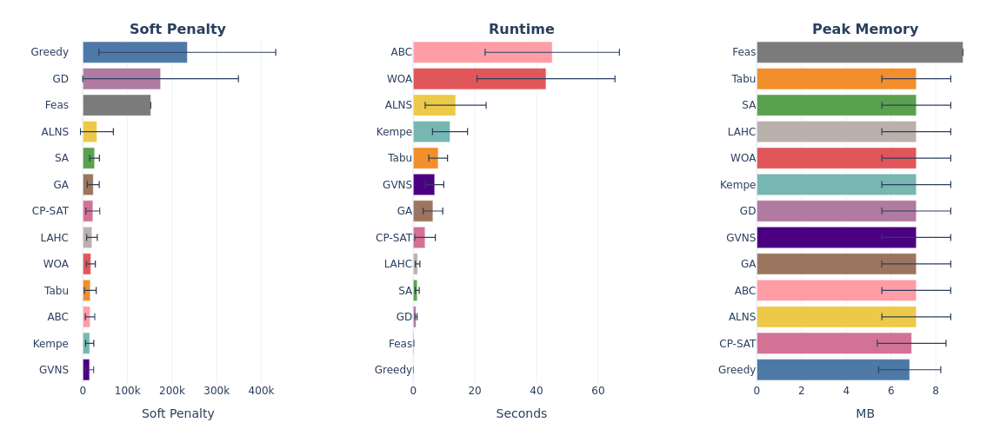
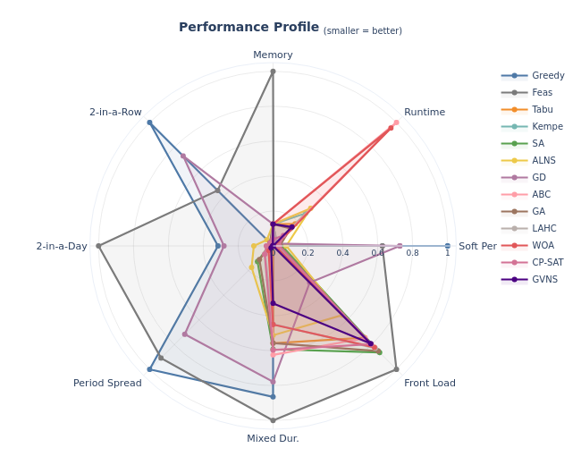
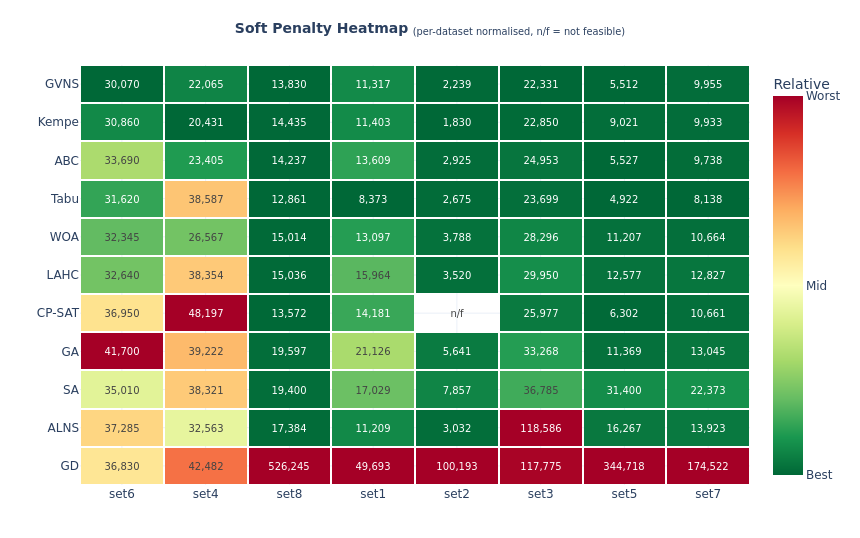
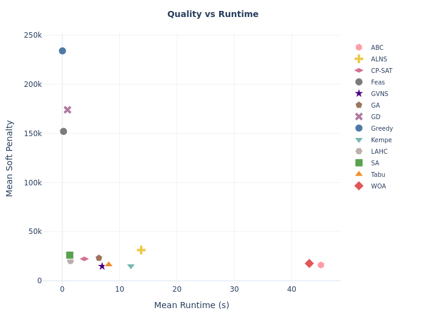
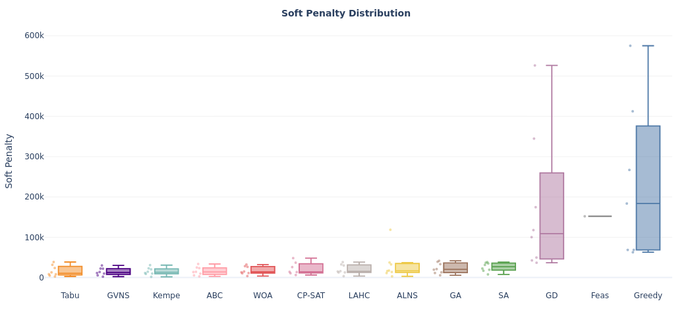
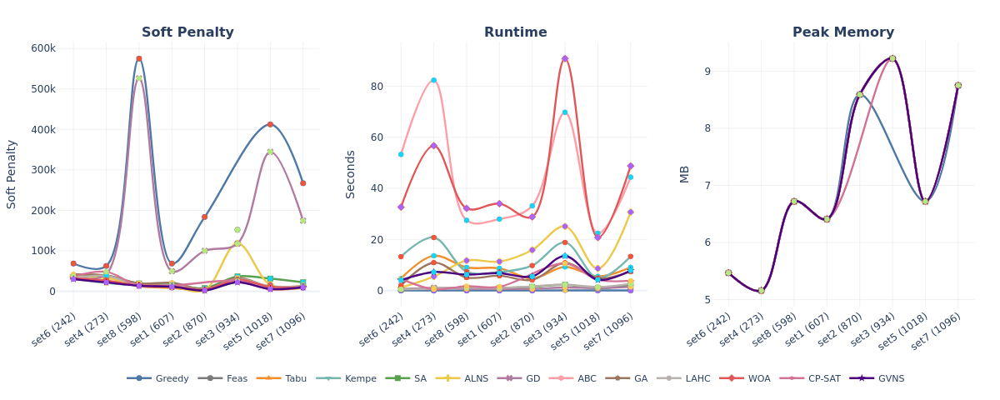
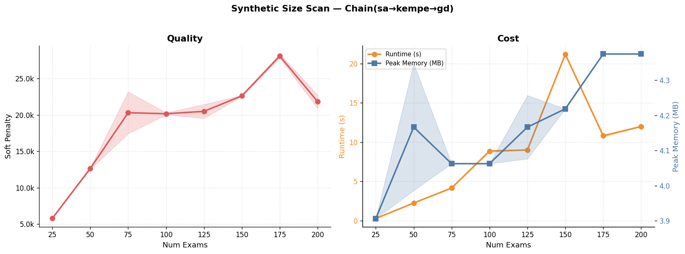

<h1 align="center">Exam Scheduling</h1>

<p align="center">
  <b>Hoang Le</b> &nbsp;·&nbsp; <b>Ian Cronin</b>
</p>

<p align="center">
  <i>Eight ITC 2007 datasets.</i>
</p>

<p align="center">
  
</p>

<p align="center"><sub>Soft penalty, runtime, and peak memory — mean with error bars across all 8 datasets.</sub></p>

---

## Table of Contents
- [Abstract](#abstract)
- [Quick Start](#quick-start)
- [Algorithms](#algorithms)
- [Datasets](#datasets)
- [Results](#results)
- [Auto-Tuner](#auto-tuner)
- [Usage](#usage)
- [Research Questions](#research-questions)
- [Reproducing the paper](#reproducing-the-paper)
- [GenAI Usage Disclosure](#genai-usage-disclosure)
- [References](#references)

---

## Problem and Approach

The problem this project tackles is the Capacitated Examination Timetabling Problem: given a finite set of exams, students, available time slots, and rooms with limited seating, assign every exam to exactly one (time slot, room) pair so that hard constraints are satisfied while minimizing soft constraint penalties. Hard constraints ensure no student sits two exams in the same period and no room exceeds capacity. Soft constraints penalize back-to-back scheduling, same-day exams, exams too close together, mixed-duration rooms, and large exams late in the schedule. Fitness is computed as `hard_violations * 100000 + soft_penalty` — feasibility always comes first.

The problem is NP-hard. It follows the graph-coloring formulation: exams are vertices, edges connect any pair sharing at least one student. No polynomial-time algorithm is known, which means exponential worst-case behavior without a heuristic approach.

Thirteen algorithms are implemented in a single C++20 solver, with a Python bridge that falls back gracefully when the binary isn't built. An auto-tuner hunts for better defaults across datasets, and a plotting module generates figures for analysis. Everything runs against the [ITC 2007 Examination Track](https://www.eeecs.qub.ac.uk/itc2007/examtrack/) benchmark and a synthetic instance generator.

## Quick start

```bash
python3 -m venv .venv && source .venv/bin/activate
pip install -r requirements.txt
make                                            # build the C++ solver
python3 main.py --dataset instances/exam_comp_set4.exam
```
<p align="center"><sub>Full guide is below in the Usage and CLI Reference.</sub></p>
That runs every algorithm on set4 (273 exams — small and fast) and drops output into a new batch under `results/`. For interactive tinkering, open `exam_scheduling.ipynb`.

---

## Algorithms

| # | Algorithm | Type | Description |
|:---:|-----------|------|-------------|
| 1 | Greedy | Constructive | DSatur graph-coloring heuristic |
| 2 | Tabu Search | Local search | Feasibility-first with swap + room-only moves |
| 3 | Kempe Chain | Local search | Conflict-chain period swaps with SA acceptance |
| 4 | Simulated Annealing | Local search | Multi-neighbourhood with geometric cooling and reheat |
| 5 | ALNS | Hybrid | Adaptive destroy-and-repair with proximity-aware operators |
| 6 | Great Deluge | Local search | Linearly decaying acceptance level + swap moves |
| 7 | ABC | Swarm | Artificial Bee Colony with cost-weighted multi-move bees |
| 8 | GA | Evolutionary | Memetic GA: Kempe mutation + saturation-degree crossover |
| 9 | LAHC | Local search | Late Acceptance Hill Climbing with history list |
| 10 | WOA | Swarm | Whale Optimization with spiral + encircling |
| 11 | CP-SAT | Exact | Constraint programming via OR-Tools CP-SAT |
| 12 | GVNS | Hybrid | General Variable Neighbourhood Search with SA acceptance |
| 13 | HHO+ | Swarm (hybrid) | Harris-Hawks escape + Levy flight with local-search refinement |

All algorithms run through one C++ binary. Python fallbacks exist for algorithms 1-8 when the binary is unavailable.

<p align="center">
  
</p>

<p align="center"><sub>Performance profile — memory, runtime, soft penalty, and individual constraint components. Smaller area is better.</sub></p>

### What makes them fast

- Delta evaluation — `move_delta()` is O(k) instead of O(n^2) full eval per move. This is the single biggest speedup and every local search leans on it.
- Swap moves — SA, LAHC, and GD expand their neighbourhood by exchanging the periods of two exams at once.
- Room post-processing — `optimize_rooms()` runs a steepest-descent room reassignment on the final solution.
- Warm-start chaining — `--init-solution` pipes one algorithm's output into the next (e.g. SA -> Kempe -> GD), so later stages start from a better place.

## Datasets

| Set | Exams | Notes |
|:---:|------:|-------|
| set4 | 273 | Small, fast — good for quick tests and parameter sweeps |
| set6 | 242 | Smallest set, minimal constraints |
| set8 | 598 | Medium, well-constrained |
| set1 | 607 | Medium, classic benchmark |
| set2 | 870 | Large, low constraint density |
| set3 | 934 | Hardest — dense period constraints |
| set5 | 1018 | Large, tight room capacity |
| set7 | 1096 | Largest set |

All sourced from the [ITC 2007 Examination Track](https://www.eeecs.qub.ac.uk/itc2007/examtrack/). A synthetic generator writes ITC 2007 format for scalability testing.

---

## Results

<p align="center">
  
</p>

<p align="center"><sub>Cross-dataset soft penalty heatmap. Rows are algorithms, columns are datasets sorted by size. Cell values are actual soft penalties; color encodes relative standing (green = best, red = worst).</sub></p>

<br/>

GVNS and Kempe hold up across the board. The tightly-constrained sets (set3, set5, set7) punish anything that can't reason carefully about room capacity — GD and ALNS struggle there while the others stay relatively stable.

> [!TIP]
> Cluttered plots (Pareto, line-across-datasets, runtime scaling, convergence) also have a `by_family=True` variant that splits the 13 algorithms into a 2×2 grid by search paradigm — Construction / Trajectory / Population / Exact-Hybrid. Those faceted files land in `graphs/*_by_family.png` when you run `make reproduce`.

<br/>

<table>
<tr>
<td width="50%">
<p align="center">
  
</p>
<p align="center"><sub>Quality vs runtime trade-off. Bottom-left is the sweet spot — fast and low penalty.</sub></p>
</td>
<td width="50%">
<p align="center">
  
</p>
<p align="center"><sub>Soft penalty distribution across datasets. Tight boxes mean consistent performance.</sub></p>
</td>
</tr>
</table>

<br/>

### Per-dataset breakdown

<p align="center">
  
</p>

<p align="center"><sub>Soft penalty, runtime, and peak memory traced across all eight datasets per algorithm.</sub></p>

<br/>

### Scalability

<p align="center">
  
</p>

<p align="center"><sub>Chain(SA, Kempe, GD) on synthetic instances from 25 to 200 exams. Quality on the left, runtime and peak memory on the right.</sub></p>

---

## Auto-tuner

Automated parameter optimization and algorithm-chain discovery. Supports single-dataset tuning or global multi-dataset mode to avoid overfitting.

```bash
# Single dataset
python3 -m tooling.auto_tuner instances/exam_comp_set4.exam

# Global — all ITC 2007 sets
python3 -m tooling.auto_tuner --all-sets
python3 -m tooling.auto_tuner --all-sets --max-time 20      # 20 min budget
python3 -m tooling.auto_tuner --all-sets --resume            # resume from checkpoint
```

The pipeline runs in four phases:

1. Quick screen — all algorithms on all datasets in parallel.
2. Parameter tuning — random + perturbation sampling on a representative subset (small / medium / large auto-picked).
3. Chain discovery — tournament over warm-started algorithm chains, evaluated across datasets. The winning chain lands in `tuned_params.json`.
4. Final validation — multi-seed on every dataset.

> [!NOTE]
> In global mode, scores are normalized per-dataset and aggregated via geometric mean. A config that's great on set4 but terrible on set1 loses to one that's merely solid across both. Every update is gated: aggregate must improve, trial counts must be comparable, and no single dataset can regress more than 15%.

Winning parameters are auto-saved to `tooling/tuned_params.json` with version history for rollback.

```bash
python3 main.py --show-params              # active defaults + version history
python3 main.py --rollback-params 2        # restore version 2 from log
```

---

## Usage

### Prerequisites

- C++ compiler with C++20 support (g++ recommended)
- Python 3.10+
- pip packages: see `requirements.txt`

### Setup

```bash
python3 -m venv .venv && source .venv/bin/activate
pip install -r requirements.txt
make
```

### CLI examples

```bash
# Single algorithm
python3 main.py --dataset instances/exam_comp_set4.exam --algo sa

# Multiple algorithms
python3 main.py --dataset instances/exam_comp_set4.exam --algo sa,gd,vns

# Custom parameters
python3 main.py --dataset instances/exam_comp_set1.exam --sa-iters 10000 --seed 123

# Auto-tune across all datasets
python3 main.py --mode tune

# View active tuned parameters
python3 main.py --show-params
```

### Direct C++ usage

```bash
./cpp/build/exam_solver instances/exam_comp_set4.exam --algo all -v
```

<details>
<summary>Full flag reference</summary>
<br/>

| Flag | Description |
|------|-------------|
| `--dataset FILE` | ITC 2007 `.exam` file |
| `--algo NAME` | `greedy`, `tabu`, `kempe`, `sa`, `alns`, `gd`, `abc`, `ga`, `lahc`, `woa`, `hho`, `cpsat`, `vns` |
| `--mode MODE` | `demo` (default), `plot`, `batches`, `tune` |
| `--size N` | Exam count for synthetic demo mode |
| `--seed N` | Random seed (default: 42) |
| `--tabu-iters` | Tabu iterations |
| `--sa-iters` | SA iterations |
| `--kempe-iters` | Kempe iterations |
| `--alns-iters` | ALNS iterations |
| `--gd-iters` | Great Deluge iterations |
| `--abc-pop` / `--abc-iters` | ABC colony size / iterations |
| `--ga-pop` / `--ga-iters` | GA population / generations |
| `--lahc-iters` / `--lahc-list` | LAHC iterations / history list length (0 = auto) |
| `--woa-pop` / `--woa-iters` | WOA population / iterations |
| `--hho-pop` / `--hho-iters` | HHO+ hawk population / iterations |
| `--cpsat-time` | CP-SAT time limit in seconds |
| `--vns-iters` / `--vns-budget` | GVNS iterations / scan budget per LS call (0 = auto) |
| `--show-params` | Print active param defaults and exit |
| `--rollback-params V` | Rollback tuned params to version V and exit |

</details>

<details>
<summary>Project structure</summary>
<br/>

```
exam-scheduling/
├── README.md
├── Makefile
├── requirements.txt
├── main.py
├── exam_scheduling.ipynb
│
├── core/
│   ├── models.py
│   ├── parser.py
│   ├── generator.py
│   ├── fast_eval.py
│   └── evaluator.py
│
├── algorithms/
│   ├── cpp_bridge.py        # subprocess bridge to the C++ binary
│   ├── ip_solver.py
│   ├── greedy.py
│   ├── tabu_search.py
│   ├── kempe_chain.py
│   ├── simulated_annealing.py
│   ├── alns.py
│   ├── great_deluge.py
│   ├── abc.py
│   └── ga.py                # Python fallbacks; LAHC/WOA/HHO+/CP-SAT/GVNS are C++-only
│
├── cpp/
│   └── src/
│       ├── main.cpp
│       ├── models.h, parser.h, evaluator.h
│       ├── seeder.h, repair.h, neighbourhoods.h, greedy.h
│       ├── tabu.h, kempe.h, sa.h, alns.h, gd.h
│       ├── abc.h, ga.h, lahc.h, woa.h, hho.h
│       └── cpsat.h, vns.h
│
├── tooling/
│   ├── tuned_params.py       # single source of truth for defaults
│   ├── tuned_params.json
│   ├── regen_figures.py      # rebuild every figure from a saved batch
│   ├── tuning_export.py      # sensitivity grid export
│   └── tuner/                # auto-tuner split into a package
│       ├── core.py, cli.py, eval.py
│       ├── sampling.py, search_spaces.py
│       ├── binary.py, synthetic.py, checkpoint.py
│
├── utils/
│   ├── batch_manager.py
│   ├── results_logger.py
│   ├── plotting.py           # thin shim re-exporting from plots/
│   └── plots/                # figure generators (split by topic)
│       ├── shared.py         # ALGO_FAMILY taxonomy, style helpers
│       ├── comparative.py    # bars, boxes, radar, heatmap, Pareto
│       ├── convergence.py    # line/scatter/scaling (with by_family facets)
│       ├── breakdown.py      # soft-constraint stacks
│       └── tuning.py         # sensitivity + trial trajectories
│
├── notebooks/
│   ├── colab_runner.ipynb    # full batch on a Colab VM
│   └── COLAB_RUNBOOK.md      # step-by-step "don't mess up your laptop" guide
│
├── instances/
├── results/
├── graphs/
├── report/
├── references/
└── tests/
```

</details>

## Research questions

1. How does each algorithm's runtime scale with input size across synthetic
   instances from 50 to 1200 exams?
2. Where does each algorithm sit on the quality-vs-runtime Pareto frontier
   when all 13 run on the same dataset?
3. How sensitive is each tunable algorithm to its parameters? A 2-D
   grid sweep + 1-D degrade plot answers this per-knob.
4. How does the exact CP-SAT solver's memory and reliability degrade as
   input size grows?

## Reproducing the paper

- Local smoke: `make reproduce` — builds the solver, runs a Tabu smoke
  on set1, and regenerates `graphs/` from the cached batch.
- Full benchmark (Colab recommended): follow
  [`notebooks/COLAB_RUNBOOK.md`](notebooks/COLAB_RUNBOOK.md) — it walks
  through [`notebooks/colab_runner.ipynb`](notebooks/colab_runner.ipynb)
  end-to-end, including the post-run step that unzips the batch locally
  and replays `make reproduce` to regenerate figures.
- CI: every push runs `.github/workflows/reproduce.yml` — compiles the
  binary, runs the pytest suite, smoke-tests Tabu on set1, and exercises
  the plotting module.

## GenAI usage disclosure

AI-assisted coding was used throughout development for algorithm implementation, debugging, and code refactoring. Experimental design, benchmarking, parameter choices, and writing were done by a non-AI entity.

## References

See [`references/references.md`](references/references.md) for the full annotated bibliography.

- [ITC 2007 Examination Track](https://www.eeecs.qub.ac.uk/itc2007/examtrack/) — benchmark datasets
- [Burke & Bykov (2008)](https://doi.org/10.1007/978-3-540-89439-1_26) — FastSA-ETP
- [Ropke & Pisinger (2006)](https://doi.org/10.1016/j.cor.2005.09.018) — ALNS
- [Hansen et al. (2010)](https://doi.org/10.1016/j.ejor.2008.10.012) — GVNS
- [Mirjalili & Lewis (2016)](https://doi.org/10.1016/j.advengsoft.2016.01.008) — WOA
- [Kirkpatrick et al. (1983)](https://doi.org/10.1126/science.220.4598.671) — Simulated Annealing
