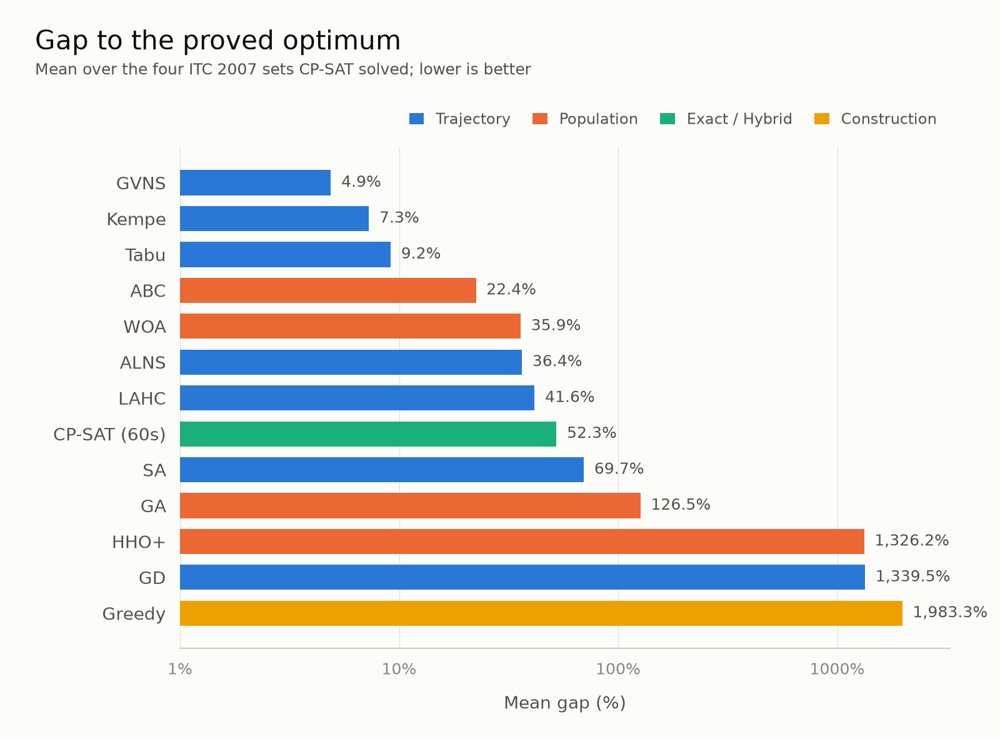
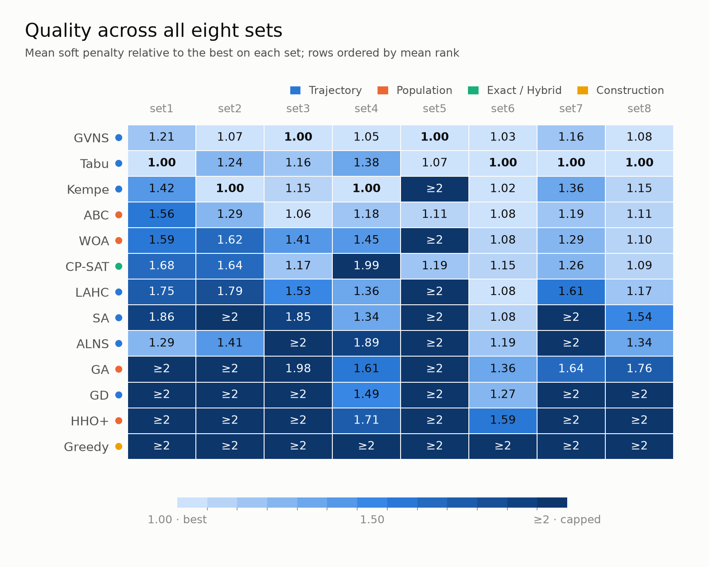
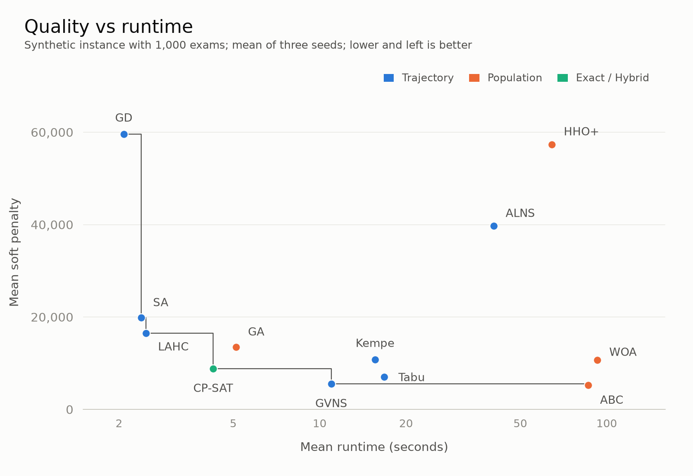
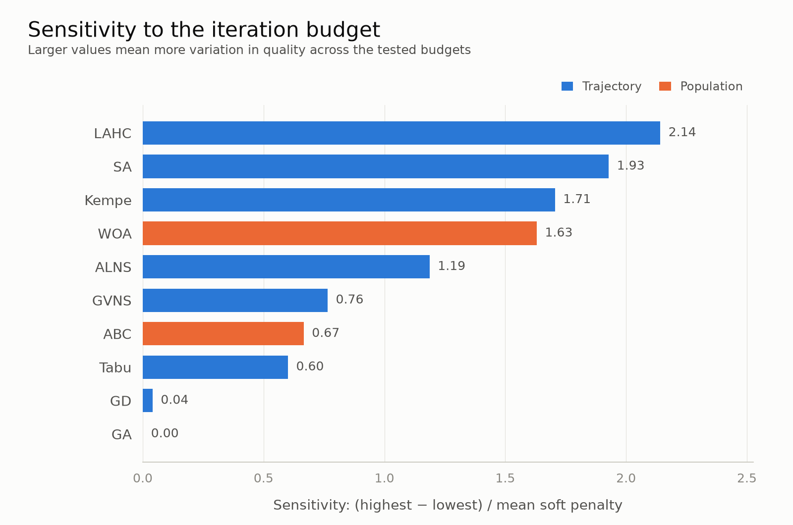

<h1 align="center">Exam Scheduling</h1>

<p align="center">
  <b>Hoang Le</b> &nbsp;·&nbsp; <b>Ian Cronin</b>
</p>

C++20 exam-timetabling solver with Python tooling and 13 algorithms across eight ITC 2007 datasets.
Set up `.venv/` and install `requirements.txt` and `requirements-dev.txt`.
Run `make`, then `cpp/build/exam_solver instances/exam_comp_set1.exam --algo tabu`.
Test with `.venv/bin/python -m pytest tests/ -x --timeout=120`.
Research is complete. The final paper and slides are in [`report/`](report/) and [`slides/`](slides/).

<p align="center">
  <picture>
    <source media="(prefers-color-scheme: dark)" srcset="graphs/readme/leaderboard-dark.png">
    
  </picture>
</p>

<p align="center"><sub>GVNS has the smallest mean gap; set8 is excluded because its IP and heuristic scores use different evaluator scales.</sub></p>

---

## Table of Contents
- [Repository map](#repository-map)
- [Quick Start](#quick-start)
- [Algorithms](#algorithms)
- [Datasets](#datasets)
- [Results](#results)
- [Auto-Tuner](#auto-tuner)
- [Phase 2 — cached, SIMD, and Thompson variants](#phase-2--cached-simd-and-thompson-variants)
- [Usage](#usage)
- [Research Questions](#research-questions)
- [Reproducing the paper](#reproducing-the-paper)
- [References](#references)

<a id="repository-map"></a>

<details>
<summary>Repository map</summary>
<br/>

A single Python entry point (`main.py`) dispatches to thirteen algorithms living under [`algorithms/`](algorithms/) (Python fallbacks) and [`cpp/src/`](cpp/src/) (the C++20 solver reached through a subprocess bridge). Shared ITC 2007 parsing, models, and O(k) delta-evaluator sit in [`core/`](core/). Batch orchestration, results logging, and the figure factory are in [`utils/`](utils/), with the auto-tuner and tuned-parameter store under [`tooling/`](tooling/). Interactive notebooks and the Colab runbook are in [`notebooks/`](notebooks/); datasets, cached batches, and paper-grade figures are in [`instances/`](instances/), [`results/`](results/), and [`graphs/`](graphs/). The written artefacts (research report, speech script, deck) live in [`report/`](report/) and [`slides/`](slides/), with annotated citations in [`references/`](references/).

| Folder | What's inside |
|--------|---------------|
| [`algorithms/`](algorithms/) | Python implementations of 8 algorithms + the C++ subprocess bridge (`cpp_bridge.py`) and OR-Tools CP-SAT / PuLP IP solver (`ip_solver.py`). |
| [`core/`](core/) | ITC 2007 parser, data models, synthetic instance generator, and the fast O(k) delta-evaluator (`fast_eval.py`, `evaluator.py`). |
| [`cpp/src/`](cpp/src/) | C++20 solver — one binary, all 13 base algorithms + Phase-2 cached/SIMD/Thompson variants. Headers per algorithm (`tabu.h`, `sa.h`, `cpsat.h`, …); shared `seeder`/`repair`/`neighbourhoods`. |
| [`tooling/`](tooling/) | Auto-tuner package (`tuner/`), tuned-param store with version history (`tuned_params.py`, `tuned_params.json`), parameter sweep and sensitivity export. |
| [`utils/`](utils/) | Batch manager, results logger, and the `plots/` figure factory (comparative, convergence, breakdown, tuning). |
| [`notebooks/`](notebooks/) | `exam_scheduling.ipynb` (local exploration), `colab_runner.ipynb` (full paper batch), `batch19_colab.ipynb` (Phase-2 validation), and [`COLAB_RUNBOOK.md`](notebooks/COLAB_RUNBOOK.md). |
| [`instances/`](instances/) | The eight ITC 2007 Examination Track `.exam` files (set1 – set8). |
| [`results/`](results/) | Per-batch outputs: `aggregated.csv`, raw solutions, per-algorithm logs. `batch_018_colab/` = paper-grade batch (13 algos, full matrix); `batch_019_colab/` = Phase-2 cached/Thompson validation. |
| [`graphs/`](graphs/) | The eight paper figures (`fig1_pareto.png` … `fig8_gap_leaderboard.png`) plus CSV `tables/` and light/dark README figures in `readme/`. Cross-batch analysis now lives as a printed-table markdown at [`graphs/CROSS_BATCH_ANALYSIS.md`](graphs/CROSS_BATCH_ANALYSIS.md). |
| [`docs/`](docs/) | [`PERF_ROADMAP.md`](docs/PERF_ROADMAP.md) — CPU design, measurements, parity validation. |
| [`report/`](report/) | Peer research report in arXiv-style flat prose (`peer_research_report.md` / `.pdf`). |
| [`slides/`](slides/) | Deck generator (`build_deck.py`, `deck_*.py`), rendered `.pptx` / `.pdf`, and the 16-slide `speech_script.md` / `.pdf`. |
| [`references/`](references/) | Annotated bibliography (`references.md`) — the full reading list behind the paper. |
| [`tests/`](tests/) | Pytest suite — tuner import smoke test, evaluator invariants, CI-facing checks. |
| [`.github/`](.github/workflows/) | `reproduce.yml` CI workflow: builds the binary, runs pytest, smoke-tests Tabu on set1. |
| [`Makefile`](Makefile) | `make` builds the C++ solver; `make reproduce` runs the local smoke + replays paper figures; `make readme-figures` renders README figures. |
| [`main.py`](main.py) | Single CLI entry point — dispatches by `--algo`, `--dataset`, `--mode`. |
| [`PROGRESS.md`](PROGRESS.md) | Long-form dev log: decisions, failed experiments, open research items. |

</details>

<details>
<summary>Full flag reference</summary>
<br/>

| Flag | Description |
|------|-------------|
| `--dataset FILE` | ITC 2007 `.exam` file |
| `--algo NAME` | Base (13): `greedy`, `tabu`, `kempe`, `sa`, `alns`, `gd`, `abc`, `ga`, `lahc`, `woa`, `hho`, `cpsat`, `vns`. Phase-2 cached/SIMD: `tabu_simd`, `tabu_cached`, `sa_cached`, `gd_cached`, `lahc_cached`, `alns_cached`, `alns_thompson`, `vns_cached`. |
| `--mode MODE` | `demo` (default), `plot`, `batches`, `tune` |
| `--size N` | Exam count for synthetic demo mode |
| `--seed N` | Random seed (default: 42) |
| `--tabu-iters` | Tabu iterations |
| `--sa-iters` | SA iterations |
| `--kempe-iters` | Kempe iterations |
| `--alns-iters` | ALNS iterations |
| `--gd-iters` | Great Deluge iterations |
| `--abc-pop` / `--abc-iters` | ABC colony size / iterations |
| `--ga-pop` / `--ga-iters` | GA population / generations |
| `--lahc-iters` / `--lahc-list` | LAHC iterations / history list length (0 = auto) |
| `--woa-pop` / `--woa-iters` | WOA population / iterations |
| `--hho-pop` / `--hho-iters` | HHO+ hawk population / iterations |
| `--cpsat-time` | CP-SAT time limit in seconds |
| `--vns-iters` / `--vns-budget` | GVNS iterations / scan budget per LS call (0 = auto) |
| `--show-params` | Print active param defaults and exit |
| `--rollback-params V` | Rollback tuned params to version V and exit |

</details>

<details>
<summary>Project structure</summary>
<br/>

```
exam-scheduling/
├── README.md
├── Makefile
├── requirements.txt
├── main.py
│
├── core/
│   ├── models.py
│   ├── parser.py
│   ├── generator.py
│   ├── fast_eval.py
│   └── evaluator.py
│
├── algorithms/
│   ├── cpp_bridge.py        # subprocess bridge to the C++ binary
│   ├── ip_solver.py
│   ├── greedy.py
│   ├── tabu_search.py
│   ├── kempe_chain.py
│   ├── simulated_annealing.py
│   ├── alns.py
│   ├── great_deluge.py
│   ├── abc.py
│   └── ga.py                # Python fallbacks; LAHC/WOA/HHO+/CP-SAT/GVNS are C++-only
│
├── cpp/
│   └── src/
│       ├── main.cpp
│       ├── models.h, parser.h, evaluator.h, cached_evaluator.h
│       ├── seeder.h, repair.h, neighbourhoods.h, greedy.h
│       ├── tabu.h, kempe.h, sa.h, alns.h, gd.h
│       ├── abc.h, ga.h, lahc.h, woa.h, hho.h
│       ├── cpsat.h, vns.h
│       ├── tabu_cached.h, sa_cached.h, gd_cached.h, lahc_cached.h, vns_cached.h
│       └── alns_cached.h, alns_thompson.h, tabu_simd.h
│
├── tooling/
│   ├── tuned_params.py       # single source of truth for defaults
│   ├── tuned_params.json
│   ├── tuning_export.py      # sensitivity grid export
│   ├── param_sweep.py        # 1-D sensitivity sweep (drives Colab sweep cell)
│   └── tuner/                # auto-tuner split into a package
│       ├── core.py, cli.py, eval.py
│       ├── sampling.py, search_spaces.py
│       ├── binary.py, synthetic.py, checkpoint.py
│
├── utils/
│   ├── batch_manager.py
│   ├── results_logger.py
│   ├── plotting.py           # thin shim re-exporting from plots/
│   └── plots/                # figure generators (split by topic)
│       ├── shared.py         # ALGO_FAMILY taxonomy, style helpers
│       ├── comparative.py    # bars, boxes, radar, heatmap, Pareto
│       ├── convergence.py    # line/scatter/scaling (with by_family facets)
│       ├── breakdown.py      # soft-constraint stacks
│       ├── tuning.py         # sensitivity + trial trajectories
│       └── readme.py         # light and dark README figures
│
├── notebooks/
│   ├── exam_scheduling.ipynb # interactive exploration notebook
│   ├── colab_runner.ipynb    # full batch on a Colab VM
│   └── COLAB_RUNBOOK.md      # step-by-step "don't mess up your laptop" guide
│
├── instances/
├── results/
├── graphs/                  # paper figures and CSV tables
│   └── readme/              # README figures in both themes
├── scripts/make_readme_figures.py
├── report/
├── references/
└── tests/
```

</details>

---

## Problem and Approach

The problem this project tackles is the Capacitated Examination Timetabling Problem: given a finite set of exams, students, available time slots, and rooms with limited seating, assign every exam to exactly one (time slot, room) pair so that hard constraints are satisfied while minimizing soft constraint penalties. Hard constraints ensure no student sits two exams in the same period and no room exceeds capacity. Soft constraints penalize back-to-back scheduling, same-day exams, exams too close together, mixed-duration rooms, and large exams late in the schedule. Fitness is computed as `hard_violations * 100000 + soft_penalty` — feasibility always comes first.

The problem is NP-hard. It follows the graph-coloring formulation: exams are vertices, edges connect any pair sharing at least one student. No polynomial-time algorithm is known, which means exponential worst-case behavior without a heuristic approach.

Thirteen algorithms are implemented in a single C++20 solver, with a Python bridge that falls back gracefully when the binary isn't built. An auto-tuner hunts for better defaults across datasets, and a plotting module generates figures for analysis. Everything runs against the [ITC 2007 Examination Track](https://www.eeecs.qub.ac.uk/itc2007/examtrack/) benchmark and a synthetic instance generator.

## Quick start

**Linux / macOS**
```bash
python3 -m venv .venv && source .venv/bin/activate
pip install -r requirements.txt
make                                            # build the C++ solver
python3 main.py --dataset instances/exam_comp_set4.exam
```

**Windows (PowerShell)**
```powershell
python -m venv .venv
.\.venv\Scripts\Activate.ps1                    # cmd.exe: .\.venv\Scripts\activate.bat
pip install -r requirements.txt
mingw32-make                                    # see "Building on Windows" if make is missing
python main.py --dataset instances\exam_comp_set4.exam
```

<p align="center"><sub>Full guide is below in the Usage and CLI Reference.</sub></p>
That runs every algorithm on set4 (273 exams — small and fast) and drops output into a new batch under `results/`. For interactive tinkering, open `notebooks/exam_scheduling.ipynb`.

---

## Algorithms

| # | Algorithm | Type | Description |
|:---:|-----------|------|-------------|
| 1 | Greedy | Constructive | DSatur graph-coloring heuristic |
| 2 | Tabu Search | Local search | Feasibility-first with swap + room-only moves |
| 3 | Kempe Chain | Local search | Conflict-chain period swaps with SA acceptance |
| 4 | Simulated Annealing | Local search | Multi-neighbourhood with geometric cooling and reheat |
| 5 | ALNS | Hybrid | Adaptive destroy-and-repair with proximity-aware operators |
| 6 | Great Deluge | Local search | Linearly decaying acceptance level + swap moves |
| 7 | ABC | Swarm | Artificial Bee Colony with cost-weighted multi-move bees |
| 8 | GA | Evolutionary | Memetic GA: Kempe mutation + saturation-degree crossover |
| 9 | LAHC | Local search | Late Acceptance Hill Climbing with history list |
| 10 | WOA | Swarm | Whale Optimization with spiral + encircling |
| 11 | CP-SAT | Exact | Constraint programming via OR-Tools CP-SAT |
| 12 | GVNS | Hybrid | General Variable Neighbourhood Search with SA acceptance |
| 13 | HHO+ | Swarm (hybrid) | Harris-Hawks escape + Levy flight with local-search refinement |

All algorithms run through one C++ binary. Python fallbacks exist for algorithms 1-8 when the binary is unavailable. The Phase-2 `*_cached` / `*_simd` / `alns_thompson` variants wrap these base 13 and are available via the same `--algo` flag — see [`docs/PERF_ROADMAP.md`](docs/PERF_ROADMAP.md) for what each layer changes and when it pays off.

### What makes them fast

- Delta evaluation — `move_delta()` is O(k) instead of O(n^2) full eval per move. This is the single biggest speedup and every local search leans on it.
- Swap moves — SA, LAHC, and GD expand their neighbourhood by exchanging the periods of two exams at once.
- Room post-processing — `optimize_rooms()` runs a steepest-descent room reassignment on the final solution.
- Warm-start chaining — `--init-solution` pipes one algorithm's output into the next (e.g. SA -> Kempe -> GD), so later stages start from a better place.

## Datasets

| Set | Exams | Notes |
|:---:|------:|-------|
| set4 | 273 | Small, fast — good for quick tests and parameter sweeps |
| set6 | 242 | Smallest set, minimal constraints |
| set8 | 598 | Medium, well-constrained |
| set1 | 607 | Medium, classic benchmark |
| set2 | 870 | Large, low constraint density |
| set3 | 934 | Hardest — dense period constraints |
| set5 | 1018 | Large, tight room capacity |
| set7 | 1096 | Largest set |

All sourced from the [ITC 2007 Examination Track](https://www.eeecs.qub.ac.uk/itc2007/examtrack/). A synthetic generator writes ITC 2007 format for scalability testing.

---

## Results

<p align="center">
  <picture>
    <source media="(prefers-color-scheme: dark)" srcset="graphs/readme/per-set-heatmap-dark.png">
    
  </picture>
</p>

<p align="center"><sub>Each cell compares the algorithm’s mean penalty with the best mean on that set; bold marks the best, and values above 2 are capped.</sub></p>

Trajectory methods take the best mean penalty on every set. GVNS and Tabu lead the mean ranks. Population methods lag on the tightly-constrained sets (set3, set5, set7) where room-capacity reasoning matters. The discovered champion chain is `alns -> kempe -> tabu` (see [Chain methodology](#chain-methodology)).

The family comparison is in [`graphs/tables/t4_family_comparison.csv`](graphs/tables/t4_family_comparison.csv), with `*` marking the family-best on each instance. **Tabu carries Trajectory** (4 family wins), **GVNS** is the close second-best (2 wins, lowest mean intra-family rank); **ABC dominates Population** (7 of 8 family wins, mean intra-family rank 1.12).

<p align="center">
  <picture>
    <source media="(prefers-color-scheme: dark)" srcset="graphs/readme/quality-vs-runtime-dark.png">
    
  </picture>
</p>

<p align="center"><sub>One mean per algorithm on synthetic n=1000; the step line marks the non-dominated choices. Greedy is infeasible here.</sub></p>

### vs CP-SAT IP optimum

The hero leaderboard compares four solved sets (set1, set2, set4, set6). Its baseline is the IP run: CP-SAT with a Tabu warm-start and a 2 h cap, which proved optimum on those sets. The “CP-SAT (60s)” bar is a separate cold main-batch run with a 60 s per-seed budget.

#### CP-SAT scaling cliff (RQ 4)

CP-SAT (OR-Tools, branch-and-bound on the full ILP, 2 h wall-clock budget) shows a hard reliability boundary, not a gradual degradation:

| Status (2 h cap) | Instances | Exam count |
|------------------|-----------|------------|
| Solved (optimum returned) | set6, set4, set8, set1, set2 | 242 – 870 |
| Timed out (no incumbent reported) | set3, set5, set7 | 934 – 1096 |

Every instance with ≤ 870 exams completes; every instance with ≥ 934 exams fails — so the practical ceiling sits in the ~900-exam band. The failure mode in our runs is timeout rather than memory: CP-SAT continues searching but cannot prove optimality before the budget elapses, and our pipeline only records the final optimum (so the empty `soft_breakdown.json` for sets 3, 5, 7 reflects "no proven optimum" rather than a crash). Heuristics, by contrast, return a feasible solution on every instance — the leaderboard above shows their gap to IP on the solvable subset, but the cliff above is what makes them *necessary* on the upper half of ITC 2007.


### Scalability

The synthetic scaling ladder covers 50–1000 exams. Runtime and penalty by family are recorded in [`graphs/fig4_scaling.png`](graphs/fig4_scaling.png).

### Chain methodology

The chain-finder uses Successive Halving, a prefix cache, and crossover to search warm-started algorithm sequences. The top five chains are in [`graphs/tables/t2_chain_top5.csv`](graphs/tables/t2_chain_top5.csv); the paper diagram is [`graphs/fig3_chain_methodology.png`](graphs/fig3_chain_methodology.png).

### Research figures

Paper figures live in `graphs/`; README figures live in `graphs/readme/` (`make readme-figures` regenerates them).

| File | Content |
|------|---------|
| `fig1_pareto.png` | Hero: Pareto frontier (quality vs runtime, n=1000 synthetic) colored by algorithm family |
| `fig2_family_heatmap.png` | Family dominance per ITC 2007 instance |
| `fig3_chain_methodology.png` | Chain-finder schematic + champion discovery trajectory |
| `fig4_scaling.png` | Runtime and soft penalty vs problem size, by family |
| `fig5_sensitivity.png` | Parameter sensitivity fingerprint: iters bars (10 algos) + non-iters heatmap |
| `fig6_ip_vs_heuristic.png` | CP-SAT IP vs best heuristic, 5 instances that solved |
| `fig7_gap_heatmap.png` | Gap to CP-SAT IP optimum per algorithm and instance |
| `fig8_gap_leaderboard.png` | Leaderboard: mean gap to the proved CP-SAT IP optimum across 4 solved instances (set8 excluded). Baseline = IP run (warm-started, 2 h cap, proves optimum); "CP-SAT (60s)" bar = cold main-batch run with 60 s per-seed budget |

Tables are in `graphs/tables/` as CSV:

| File | Content |
|------|---------|
| `t1_leaderboard.csv` | Algo × instance soft-penalty grid, sorted by mean rank. IP row shows full-converged CP-SAT (dash = timed out at 2 h; `*` on `set8` flags the evaluator-scale anomaly excluded from fig 7/8) |
| `t2_chain_top5.csv` | Top-5 chains discovered by the chain-finder, scored across all instances |
| `t3_partial_adopt.csv` | Tuner-proposed param deltas: which were adopted vs reverted, and why |
| `t4_family_comparison.csv` | Per-family algo breakdown (un-collapsed companion to fig 2). Cell = mean ± std soft penalty; `*` = family-best on that instance (only fires when 2+ algos compete in the family on that row); *Family Rank* = mean intra-family rank, *Family Wins* = instances where this algo is best in its family. Solo-member families (Construction = Greedy alone; Exact/Hybrid = CP-SAT alone) report `--` for both columns |

Regenerate with:

```bash
python3 results/batch_018_colab/make_paper_figures.py
```

---

## Auto-tuner

Automated parameter optimization and algorithm-chain discovery. Supports single-dataset tuning or global multi-dataset mode to avoid overfitting.

```bash
# Single dataset
python3 -m tooling.auto_tuner instances/exam_comp_set4.exam

# Global — all ITC 2007 sets
python3 -m tooling.auto_tuner --all-sets
python3 -m tooling.auto_tuner --all-sets --max-time 20      # 20 min budget
python3 -m tooling.auto_tuner --all-sets --resume            # resume from checkpoint
```

The pipeline runs in four phases:

1. Quick screen — all algorithms on all datasets in parallel.
2. Parameter tuning — random + perturbation sampling on a representative subset (small / medium / large auto-picked).
3. Chain discovery — tournament over warm-started algorithm chains, evaluated across datasets. The winning chain lands in `tuned_params.json`.
4. Final validation — multi-seed on every dataset.

> [!NOTE]
> In global mode, scores are normalized per-dataset and aggregated via geometric mean. A config that's great on set4 but terrible on set1 loses to one that's merely solid across both. Every update is gated: aggregate must improve, trial counts must be comparable, and no single dataset can regress more than 15%.

### Iteration sensitivity

<p align="center">
  <picture>
    <source media="(prefers-color-scheme: dark)" srcset="graphs/readme/iteration-sensitivity-dark.png">
    
  </picture>
</p>

<p align="center"><sub>Sensitivity = (highest − lowest) / mean soft penalty across the tested iteration budgets; larger values suggest more tuning payoff.</sub></p>

Winning parameters are auto-saved to `tooling/tuned_params.json` with version history for rollback.

```bash
python3 main.py --show-params              # active defaults + version history
python3 main.py --rollback-params 2        # restore version 2 from log
```

---

## Phase 2 — cached, SIMD, and Thompson variants

Post-batch-18 CPU performance work added a new layer on top of the original 13 algorithms:

- **Phase 2 (CPU)** — incremental **cached evaluator**, **Thompson-sampling AOS**, AVX2-SIMD `move_delta`, xoshiro256++ RNG, and multi-depth ejection chains. Shipped as `tabu_cached`, `sa_cached`, `gd_cached`, `lahc_cached`, `alns_cached`, `alns_thompson`, `vns_cached`, `tabu_simd`.

Measured speedups, parity validation, and cache overhead are in [`docs/PERF_ROADMAP.md`](docs/PERF_ROADMAP.md).

**Two validation batches live under `results/`:**

| Batch | Scope | Notebook |
|---|---|---|
| `batch_018_colab/` | 13 algos × 8 sets × 7 seeds, chain tournament, scaling ladder, sensitivity sweep, CP-SAT IP | [`colab_runner.ipynb`](notebooks/colab_runner.ipynb) |
| `batch_019_colab/` | 5 Phase-2 cached/Thompson variants × 8 sets × 3 seeds (feasibility + parity check) | [`batch19_colab.ipynb`](notebooks/batch19_colab.ipynb) |

See each batch's `INDEX.md` / `README.md` for what's in (and intentionally not in) it.

**Running locally:**
```bash
make batch19 BATCH19_SEEDS="42 43 44 45 46" \
             BATCH19_ALGOS="tabu_cached sa_cached alns_thompson" \
             BATCH19_SETS="exam_comp_set4 exam_comp_set7"
python3 scripts/summarize_batch19.py results/batch_019_validation
```

Colab: open the corresponding notebook and `Runtime → Run all`. Batch 19 is CPU-bound — use a **High-RAM CPU** runtime.

**Cross-batch analysis tables** (coverage, global normalized ranking, tier progression, per-instance winners, same-batch variant deltas, runtime comparison) are in [`graphs/CROSS_BATCH_ANALYSIS.md`](graphs/CROSS_BATCH_ANALYSIS.md) and regenerated by `python3 scripts/make_batch_comparison.py` (prints to stdout + rewrites the file).

**Microbenchmarks** (move_delta + portfolio): `make bench-omp BENCH_INSTANCE=instances/exam_comp_setX.exam`. Builds with `g++` and `make`.

---

## Usage

### Prerequisites

- C++ compiler with C++20 support (g++ recommended; on Windows use WSL2 or MinGW-w64 via MSYS2)
- GNU Make (Linux/macOS native; Windows: `mingw32-make` from MSYS2, or Make inside WSL2)
- Python 3.10+
- pip packages: see `requirements.txt`

### Setup

**Linux / macOS**
```bash
python3 -m venv .venv && source .venv/bin/activate
pip install -r requirements.txt
make
```

**Windows (PowerShell)**
```powershell
python -m venv .venv
.\.venv\Scripts\Activate.ps1
pip install -r requirements.txt
mingw32-make                                    # MSYS2/MinGW; or skip and use Python fallbacks
```

<details>
<summary>Building on Windows (g++ / make)</summary>
<br/>

The C++ solver uses C++20 + `-march=native -flto`. The path of least resistance:

- **WSL2** (recommended) — install Ubuntu, then follow the Linux instructions verbatim. Best performance, full Make support.
- **MSYS2 / MinGW-w64** — install [msys2.org](https://www.msys2.org/), then in the MSYS2 UCRT64 shell run `pacman -S mingw-w64-ucrt-x86_64-gcc make`. Build with `mingw32-make` from PowerShell, or `make` from inside the MSYS2 shell.
- **Skip the C++ build** — algorithms 1–8 have Python fallbacks in `algorithms/`. They're slower (~10–50×) but require no compiler. The notebook and most plotting works fine without the binary.

If you go the MSYS2 route, ensure `C:\msys64\ucrt64\bin` is on `PATH` so `g++.exe` resolves.

</details>

### CLI examples

**Linux / macOS**
```bash
python3 main.py --dataset instances/exam_comp_set4.exam --algo sa
python3 main.py --dataset instances/exam_comp_set4.exam --algo sa,gd,vns
python3 main.py --dataset instances/exam_comp_set1.exam --sa-iters 10000 --seed 123
python3 main.py --mode tune
python3 main.py --show-params
```

**Windows (PowerShell)**
```powershell
python main.py --dataset instances\exam_comp_set4.exam --algo sa
python main.py --dataset instances\exam_comp_set4.exam --algo sa,gd,vns
python main.py --dataset instances\exam_comp_set1.exam --sa-iters 10000 --seed 123
python main.py --mode tune
python main.py --show-params
```

### Direct C++ usage

```bash
# Linux / macOS
./cpp/build/exam_solver instances/exam_comp_set4.exam --algo all -v

# Windows (PowerShell)
.\cpp\build\exam_solver.exe instances\exam_comp_set4.exam --algo all -v
```

## Research questions

1. How does each algorithm's runtime scale with input size across synthetic
   instances from 50 to 1000 exams?
2. Where does each algorithm sit on the quality-vs-runtime Pareto frontier
   when all 13 run on the same dataset?
3. How sensitive is each tunable algorithm to its parameters? A 2-D
   grid sweep + 1-D degrade plot answers this per-knob.
4. How does the exact CP-SAT solver's memory and reliability degrade as
   input size grows? *(See "CP-SAT scaling cliff" under Results — the
   ITC 2007 batch shows a hard reliability boundary near 900 exams,
   not a gradual degradation.)*

## Reproducing the paper

- Local smoke: `make reproduce` — builds the solver, runs a Tabu smoke
  on set1, and regenerates `graphs/` from the cached batch.
- Full benchmark (Colab recommended): follow
  [`notebooks/COLAB_RUNBOOK.md`](notebooks/COLAB_RUNBOOK.md) — it walks
  through [`notebooks/colab_runner.ipynb`](notebooks/colab_runner.ipynb)
  end-to-end, including the post-run step that unzips the batch locally
  and replays `make reproduce` to regenerate figures.
- Phase-2 cached/Thompson validation: [`notebooks/batch19_colab.ipynb`](notebooks/batch19_colab.ipynb) → writes `results/batch_019_colab/`.
- Cross-batch analysis tables: `python3 scripts/make_batch_comparison.py` (reads the two batch folders, prints + rewrites [`graphs/CROSS_BATCH_ANALYSIS.md`](graphs/CROSS_BATCH_ANALYSIS.md)).
- CI: every push runs `.github/workflows/reproduce.yml` — compiles the
  binary, runs the pytest suite, smoke-tests Tabu on set1, and exercises
  the plotting module.

## References

See [`references/references.md`](references/references.md) for the full annotated bibliography.

- [ITC 2007 Examination Track](https://www.eeecs.qub.ac.uk/itc2007/examtrack/) — benchmark datasets
- [Burke & Bykov (2008)](https://doi.org/10.1007/978-3-540-89439-1_26) — FastSA-ETP
- [Ropke & Pisinger (2006)](https://doi.org/10.1016/j.cor.2005.09.018) — ALNS
- [Hansen et al. (2010)](https://doi.org/10.1016/j.ejor.2008.10.012) — GVNS
- [Mirjalili & Lewis (2016)](https://doi.org/10.1016/j.advengsoft.2016.01.008) — WOA
- [Kirkpatrick et al. (1983)](https://doi.org/10.1126/science.220.4598.671) — Simulated Annealing
